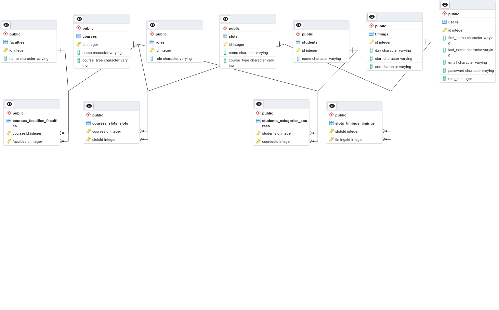

# FFCS Management Portal

Backend to implement the FFCS System used for Course Selection in VIT.

## Entities and Relationships

### Entities

The following Entities are involved in the FFCS System

- **Student**: 
- **User**: 
- **Faculty**: 
- **Course**: 
- **Slot**: 
- **Timing**: 

### Relationships

## API Documentation

### Quickstart:

`npm i && npm run dev`
Go to `/docs`: To view the Swagger API.

For more details, you can take a look at the [**Boilerplate's Readme**](./BOILERPLATE_README.md).

## External Sources

- [**Kutia's Express-TypeScript Starter Template**](https://kutia-software-company.github.io/express-typescript-starter)